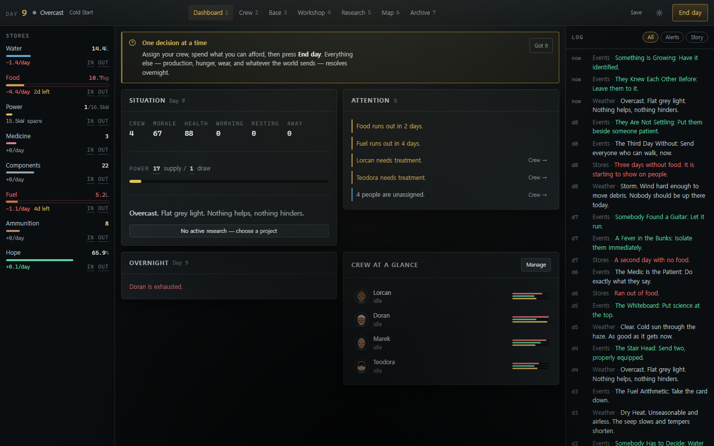
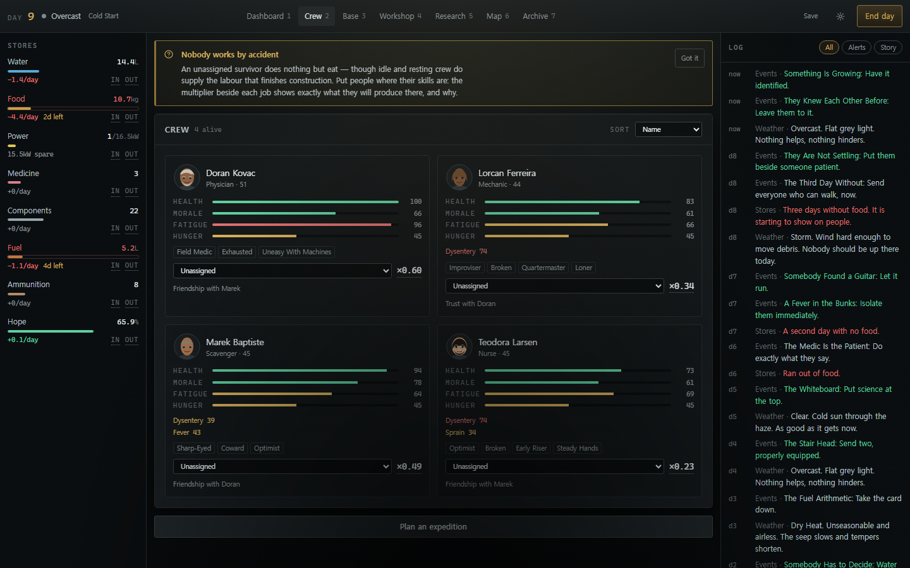
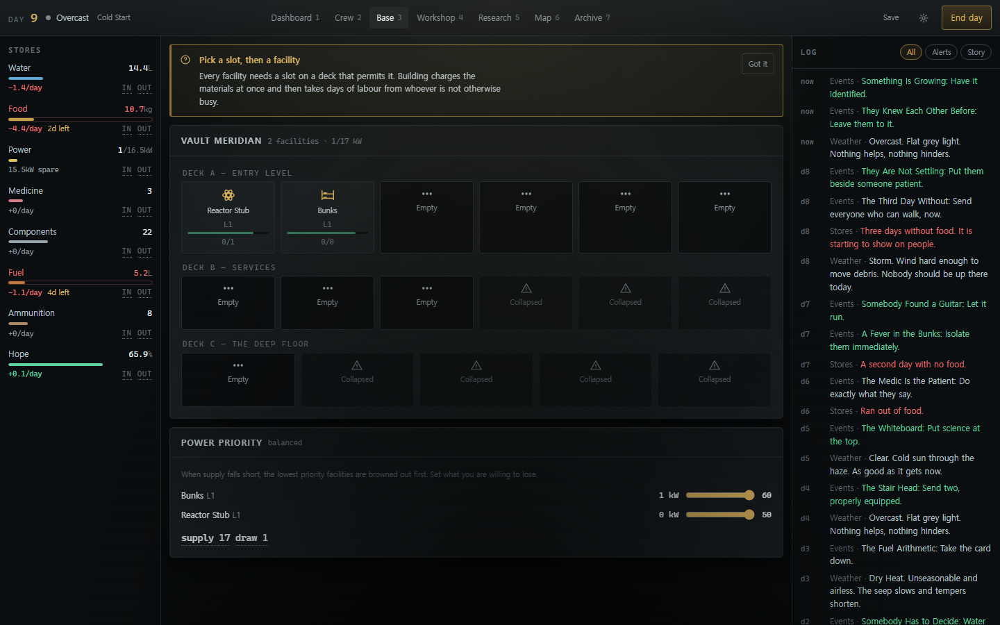
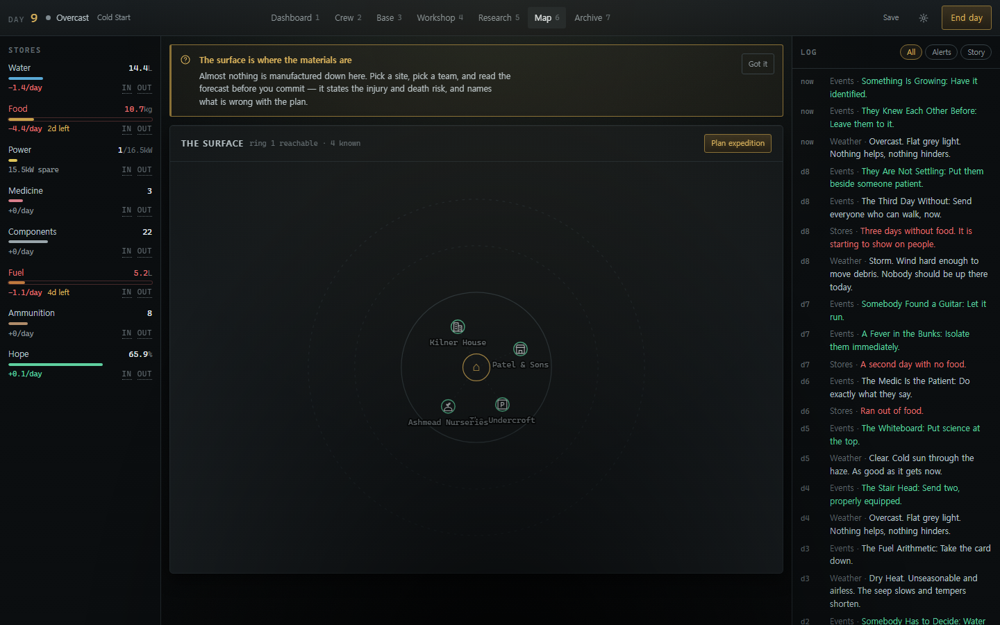
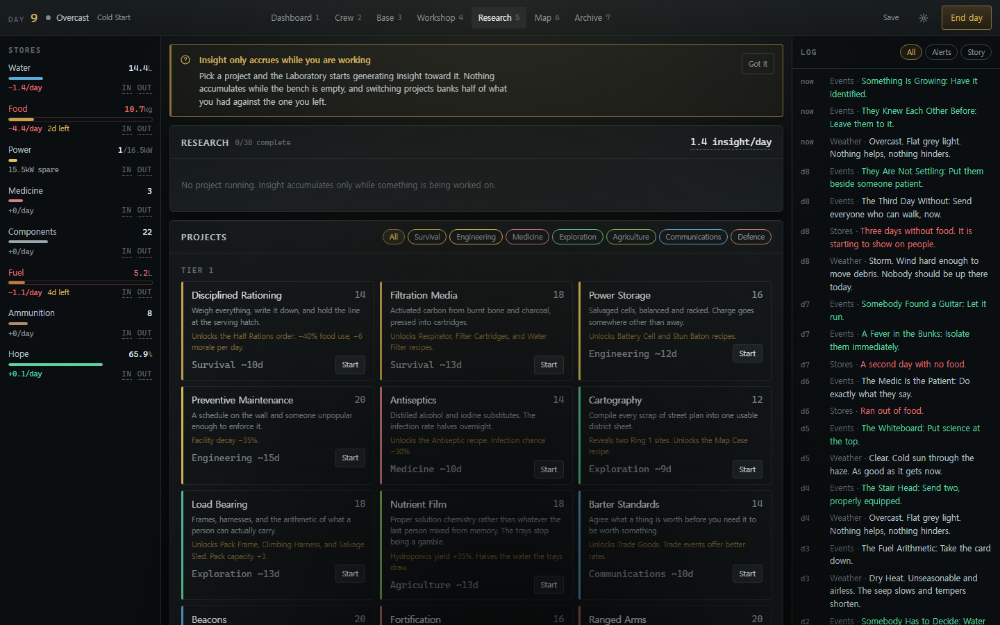
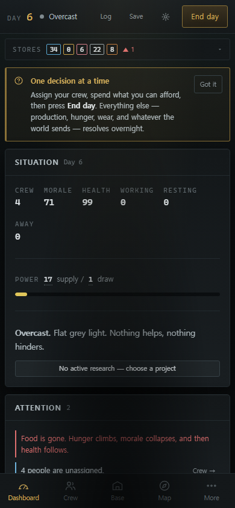
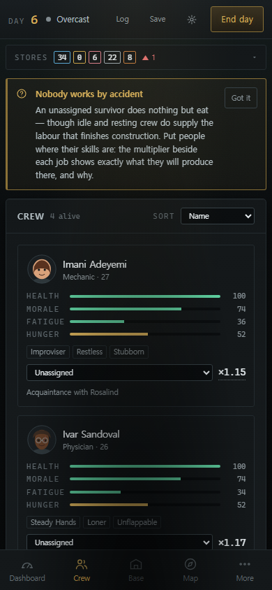

# LAST LIGHT

**[▶ Play it in your browser](https://jeiel85.github.io/last-light/)**

[](https://github.com/jeiel85/last-light/actions/workflows/ci.yml)
[](https://github.com/jeiel85/last-light/actions/workflows/pages.yml)
[](LICENSE)

A browser-based survival-management roguelite. You command a handful of survivors inside
**Vault Meridian**, an abandoned civil-defence facility, in the months after the event they
have started calling *the Quiet*.



Every day you decide who works, what gets built, what gets researched, and who goes up the
stair. Every night the vault produces and consumes, people get hungry and tired, machines
wear out, and the world asks you a question you would rather not answer. A run lasts
20–60 days and ends in one of ten ways.

- **Genre**: survival management · roguelite · narrative strategy
- **Session**: 30–90 minutes per run, save and resume at any point
- **Platform**: web — desktop, tablet, and phone; installable as a PWA; fully offline
- **Local-first**: no accounts, no servers, no analytics, no telemetry

---

## The loop

1. **Plan the morning.** Assign people to facilities, to rest, or to nothing.
2. **Spend.** Build, upgrade, repair, craft, research — every cost is charged up front.
3. **Go outside.** Form an expedition, pack it, and read the forecast before committing.
4. **End the day.** Production and consumption resolve, needs advance, machines decay.
5. **Answer.** The night selects events; each one is a choice with a stated price.
6. **Live with it.** Consequences land immediately, or three days later, or at the ending.

### Design pillars

- **Scarcity is the antagonist.** Every number on screen is either running out or about to.
- **No clean choices.** The obviously-correct option is rare, and it is never free.
- **People, not units.** Survivors have names, histories, opinions, and the capacity to break.
- **The world explains itself slowly.** No opening exposition; the catastrophe is assembled
  from radio fragments, documents, and theories that contradict each other.
- **Legibility.** Every derived number opens into the terms that produced it. Risk is
  previewed before it is taken. Nobody dies without the odds having been on screen first.

---

## What it looks like

Every pixel below is generated at run time — CSS, SVG, and procedural geometry. There are no
image assets in the repository, and these shots are captured from a real build by
`npm run screenshots`, so they cannot drift from the game.

| | |
|---|---|
|  |  |
| **Crew** — skills, traits, injuries, relationships, and a work multiplier you can open up | **Base** — a cross-section of three decks, with power priority and collapsed sections |
|  |  |
| **Map** — a radial region, three rings, danger and knowledge per site | **Research** — 38 nodes across seven branches, each unlocking something mechanical |

<p align="center">
  
  
</p>

On a phone the interface is reorganised rather than shrunk: four destinations on a bottom tab
bar with the rest behind **More**, the status rail collapsed into a strip that expands, and the
log moved into a drawer.

---

## Playing

| | |
|---|---|
| Panels | `1`–`7` |
| Close a dismissible dialog | `Esc` |
| Move focus | `Tab` / `Shift`+`Tab` |
| Activate | `Enter` / `Space` |

Story dialogs — events and expedition beats — deliberately cannot be dismissed. They are
the decision, not an interruption to it.

On phones the interface is reorganised rather than shrunk: four destinations on a bottom
tab bar with the rest behind **More**, the status rail collapses into an expandable strip,
and the log becomes a drawer.

### Accessibility

Reduced motion, high contrast, four text scales, numeric gauge mode, and full keyboard
navigation, all in **Settings** and all applied without a reload. No essential information
is conveyed by colour alone: every gauge pairs its bar with a name and a figure, and every status
marker carries a label. Sound is off by default and is entirely synthesised.

---

## Running it

```bash
npm install
npm run dev          # development server on :5173
```

```bash
npm run build        # generates icons, type-checks, and builds to dist/
npm run preview      # serve the production build
```

### Everything else

| Command | What it does |
|---|---|
| `npm test` | Vitest: engine, save, UI components, content validation, 200 headless runs |
| `npm run test:watch` | The same suite in watch mode |
| `npm run test:coverage` | Coverage over `src/engine` |
| `npm run lint` | oxlint over `src` and `tests` |
| `npm run validate` | Content validation on its own, with a full report |
| `npm run simulate` | Headless balance simulation — see below |
| `npm run e2e` | Playwright, three viewports, against a production build |
| `npm run e2e:install` | Install the Playwright browser once |
| `npm run verify` | lint + test + build, the gate before a release |
| `npm run deploy:pages` | Build with the correct base path for GitHub Pages |
| `npm run screenshots` | Recapture the README screenshots from a running build |

---

## Architecture

The load-bearing constraint is that **the simulation runs headlessly in Node with no React,
no DOM, and no `Math.random`.** Everything else follows from it, and a test suite enforces
it.

```
src/
  engine/          pure, deterministic simulation — importable by Node
    core/          seeded RNG, maths, Breakdown (a number plus its labelled terms)
    model/         every domain type; the save shape lives here
    data/          content: resources, traits, facilities, items, recipes, research,
                   locations, encounters, events (10 themed modules), lore, scenarios
    systems/       resources, survivors, facilities, crafting, research, world,
                   expedition, combat, events (conditions/effects/selection), dayCycle
    sim/           headless agent, run harness, balance report
  store/           zustand stores; game actions are thin wrappers over engine reducers
  save/            IndexedDB, versioned schema, migration chain, export/import
  ui/              React: app shell, layout, panels, modals, components, audio, theme
  content-validation/  referential integrity over every data table
```

- **Determinism.** `RngState` is four uint32 values inside `GameState`, so a save resumes
  the exact same stream. `rng.fork(label)` derives named substreams, which is why adding
  rolls to one system cannot change another system's output — or invalidate a seed.
- **Legibility.** Any number the player might question is computed as a `Breakdown`:
  a total plus labelled contributing terms, some carrying a fix hint. One popover component
  renders all of them, so inspectability is structural rather than something to remember.
- **The day pipeline.** `advanceDay(state)` is the only function that moves time. Event
  selection produces a *queue*; the UI and the headless agent resolve it through the same
  `resolveEvent`, which is why the simulator exercises the code a player actually runs.

### Where saves live

In the browser's **IndexedDB**, database `lastlight`, stores `saves` (slot 0 is the
autosave, slots 1–5 are manual) and `meta` (Legacy profile, unlocks, lore archive,
settings). Nothing leaves the machine.

A save that cannot be read is never destroyed: the slot is listed with its problem and an
**Export** button, so the file can always be recovered. Saves carry a version and run
through a migration chain on load; a file from a newer build is refused with an
explanation rather than a crash.

---

## Balance

Balance is derived from simulation output rather than guessed. The headless agent plays a
competent-but-not-optimal policy through the public engine API:

```bash
npm run simulate                                    # 200 runs, all four strategies
npm run simulate -- --runs 500 --difficulty absolute
npm run simulate -- --runs 200 --scenario cold_start --json out.json
```

The report gives the survival curve, ending distribution, and per-strategy win rates, and
raises warnings for the failure modes that matter: unavoidable starvation, resources
running away, facilities nobody ever builds, research nobody can afford, and dominant
strategies. Every tuning constant lives in `src/engine/data/balance.ts`.

---

## Adding content

All content is data. Nothing below requires touching the UI.

### An event — `src/engine/data/events/*.ts`

```ts
{
  id: 'soc.the_argument',
  title: 'The Argument',
  body: 'It starts about the water ration and stops being about the water ration.',
  tags: ['social'],
  phase: 'dusk',
  weight: 20,
  cooldown: 8,
  requires: { kind: 'survivorCount', min: 3 },
  choices: [
    {
      id: 'intervene',
      label: 'Step between them',
      check: { skill: 'negotiation', target: 6, actor: 'best' },
      onSuccess: [{ kind: 'relationship', a: 'actor', b: 'random_other', amount: 12 }],
      onFailure: [{ kind: 'need', target: 'all', need: 'morale', amount: -6 }],
      successText: 'It holds. Barely.',
      failureText: 'You become the third person in the argument.',
    },
  ],
}
```

Conditions and effects are discriminated unions declared in `src/engine/model/types.ts`;
add a case there and in `systems/events/{conditions,effects}.ts` to extend the vocabulary.
Chains (`chain`) fire immediately, `schedule` fires N days later.

### An item — `src/engine/data/items.ts`

Give it an `id`, `category`, `weight`, `tags`, `salvage`, and an `icon` name. If the icon
name has no drawing in `src/ui/components/Icon.tsx`, add one there — a name never renders
as text. A consumable must carry a `use`; a wearable must carry a `slot`.

### A trait — `src/engine/data/traits.ts`

Declare `effects` from the `TraitEffect` union (and `conflicts`, symmetrically). The hooks
in `systems/traits.ts` read them; a trait with no effect fails content validation.

### A facility — `src/engine/data/facilities.ts`

Exactly three levels, each with `buildCost`, `labour`, `powerDraw`, `staffSlots`, and a
one-line `summary`. Declare the `decks` it may sit on and the `skill` its staff use. Wire
its production into `systems/resources.ts`.

### A research node — `src/engine/data/research.ts`

`requires` must reference nodes at the same tier or lower; the validator proves the graph
is acyclic and fully reachable. `unlocks` entries are checked against real recipes,
facilities, and endings.

### A location — `src/engine/data/locations.ts`

Give it `rings`, `maxInstances`, `nameForms`, a `loot` table, and `encounterTags` that
intersect the tags on the encounter beats you want it to draw.

Run `npm run validate` after any of these. Broken references fail the build.

---

## Quality gates

Everything below passes on the current tree:

- `npm run build` — clean, zero TypeScript errors under `strict`
- `npm test` — 301 tests across 15 files
- `npm run e2e` — 144 tests across desktop, tablet, and mobile, zero console errors
- `npm run lint` — zero errors
- `npm run validate` — every reference in every data table resolves
- `npm run simulate` — 200 runs, no errors, no resource runaway

---

## Deploying

```bash
npm run deploy:pages
```

builds with `LASTLIGHT_BASE` set for a project page and writes `dist/`, including a
`.nojekyll` marker and a `404.html` fallback. Publish `dist/` to the `gh-pages` branch, or
point any static host at it. The app is entirely static and needs no server.

To host at a sub-path elsewhere, set the base yourself:

```bash
LASTLIGHT_BASE=/games/last-light/ npm run build
```

---

## Licence

MIT. All visuals are generated at runtime from code — CSS, SVG, and procedural geometry —
and all audio is synthesised through WebAudio. There are no third-party assets.
